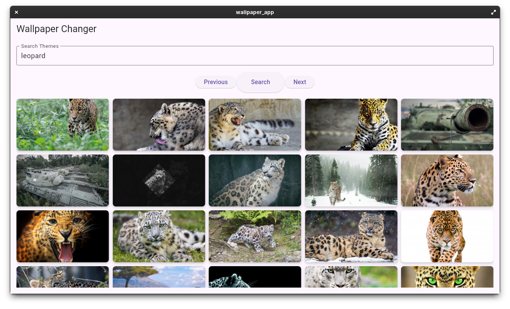

# Wallpaper Changer
_name subject to change_

Simple app which allows you to change your wallpaper by searching for a topic using the wallhaven.cc source API.

### Supports:
- Linux (Gnome only, other DEs coming soon)
  - Can use Linux Release .zip provided in Releases
  - Includes `build_from_source.sh` and `build_uninstal.sh`
- Windows
  - Will need to use the Windows Release .zip provided in Releases
  - _Install script coming soon_

## How to install
### Windows:
- Download `wallpaper_changer-release.zip` provided in Releases
- Extract the zip
- Run the `app_runner` file from terminal

### Linux:

#### Recommended way:
- Run the `build_from_source.sh` file from terminal
- Create .desktop file pointing to install path `/usr/share/wallpaper_changer/app_runner`
  - Could use create-desktop-file to assist with this: (https://github.com/Catley94/RustSource_CreateDesktopFile)
    - This will create a .desktop file in `.local/share/applications`
- (Also creates a symlink using the alias `wallpaper_changer`)
  - Allows you to run `wallpaper_changer` within terminal

#### Alternative way:
- Download `wallpaper_changer-release.zip` provided in Releases
- Extract the zip
- Run the `release_install.sh` file from terminal

## How to use
- Type a topic in the search box 
- Click on the search button
- (Navigate between pages using previous and next buttons)
- Click on an image (This will change your wallpaper)

### Important Notes for usage
This program self cleans, meaning once the thumbnails folder is over 500MB, it will delete all thumbnails inside.

### Collections / Tags
- You can now create collections (tags) and tag images.
- Where files go:
  - Thumbnails: user data dir/thumbnails
  - Downloads: user data dir/wallpapers
  - Collections: user data dir/collections/<tag>/ (contains copies of downloaded images)
- In the app:
  - Use the bottom navigation to switch to the Collections tab.
  - Press the + button to create a new tag.
  - Go to the Search tab, long-press any thumbnail, select a tag to add it. This downloads the original (if not yet) and copies it into the tag folder.

Backend endpoints (for reference):
- GET /collections → Lists tags and their image paths.
- POST /collections/tags { name } → Creates a tag folder.
- POST /collections/tag-image { id, tag } → Downloads the image by id and copies it into the tag folder.

## Developer Notes
- This program uses the wallhaven.cc API
- This project has three projects included:
  - wallpaper_changer (Rust root project `./`)
    - API which has endpoints to search for images and change wallpaper
  - wallpaper_app (Flutter frontend `./wallpaper_app`)
    - Front end to interact with the API and display thumbnails
  - app_runner (Rust App Runner `./app_runner`)
    - To easily run both the Rust API and Flutter frontend at the same time

### To update the build
- Make changes to code
- Run `source_code_uninstall.sh` to uninstall any existing builds
- Run `source_code_install.sh` to install new build
- If it works, run `dev_copy_binary_to_release_folder.<sh/bat>`